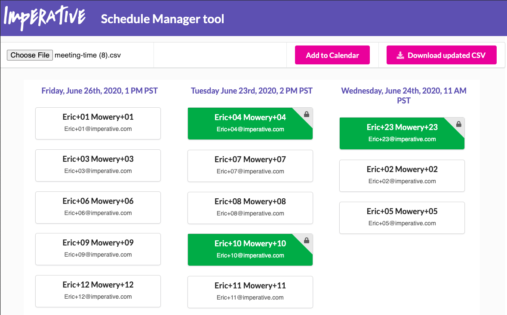

## Coffee-script

Run `yarn` to install dependencies

Run `yarn dev` runs both watch & start in same terminal

Utilizes:
- CoffeeScript version 2.5.1
- React version 16.4.0

## Coffee-script

Coffee-script, no semi-colons yay!

To use, put your .coffee files into `./cs` folder.

The strategy is to just covert coffee-script code from `./cs` folder into `./src`.

`/src/*.js` is in `.gitignore`

### Dev

`yarn watch` - watches `./cs` folder, converts `.coffee` files to `/src`
`yarn start` - in another terminal... Create-React-App's dev server

alternatively

`yarn dev` - runs both watch & start in same terminal

----

This project was bootstrapped with [Create React App](https://github.com/facebookincubator/create-react-app).
